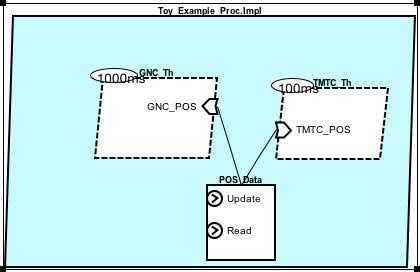
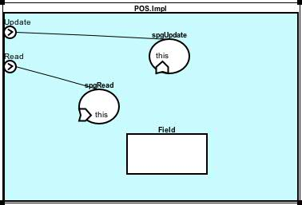

1、来源
===========
首次是从~/ocarina-2.0w-suite-x86_64-darwin-20141103/examples/ocarina/polyorb-hi-c/aadlv2/d3.1.3-1/导入。

2、说明
===========
该系统为执行GNC和TMTC两个任务。
GNC任务的子程序执行顺序是：

Welcome -> Update_POS -> GNC_Job -> Read_POS -> Bye

TMTC任务的子程序执行顺序是：

Welcome -> TMTC_Job -> Update -> Bye

其中:

- 子程序Update_POS和Update都是POS.Update型的子程序。
- 子程序Read_POS是POS.Read型的子程序。
- 其他子程序只是简单打印信息或加入一些空转（如GNC_Job和TMTC_Job）。

1）核心组件Toy_Example_Proc.Impl
-------------

整个系统的核心是process型的组件Toy_Example_Proc.Impl。

	process implementation Toy_Example_Proc.Impl
	subcomponents
	  GNC_Th   : thread GNC_thread.Impl;
	  TMTC_Th  : thread TMTC_Thread.Impl;
	  POS_Data : data POS.Impl;
	connections
	  Cnx_Proc_2 : data access POS_Data -> GNC_Th.GNC_POS;
	  Cnx_Proc_3 : data access POS_Data -> TMTC_Th.TMTC_POS;
	end Toy_Example_Proc.Impl;

其内部是三个子组件。

注意：两个接口连接都是`data access`型的。

2）POS/POS.Impl组件
-------------

Data型的构件POS，是整个系统数据的持有者，对外提供`subprogram access`型的接口。

- Update
- Read

其内部包含3个子构件。

	data POS
	features
	  Update : provides subprogram access Update;
	  Read   : provides subprogram access Read_POS;
	properties
	  Priority => 250;
	end POS;
	
	data implementation POS.Impl
	subcomponents
	  Field : data POS_Internal_Type;
	  spgUpdate : subprogram Update;
	  spgRead   : subprogram Read_POS; 
	
	connections
	  Cnx_Pos_1 : subprogram access SpgUpdate -> Update;
	  Cnx_Pos_2 : subprogram access SpgRead -> Read;
	
	properties
	  Data_Model::Data_Representation => Struct;
	end POS.Impl;
	

3）Update和Read子程序
-------------

特别需注意的是子程序Update和Read子程序构件的定义。它们都有`this: requires data access POS.Impl`的接口申明。

	subprogram Update
	features
	  this : requires data access POS.Impl;
	properties
	  source_language => C;
	  source_name     => "user_update";
	  source_text     => ("toy.c");
	end Update;		

4）GNC相关的子程序
-------------

GNC_Thread是thread型的组件，作为GNC任务的被调度的对象。它的对外需求`data access`型的接口。然后从接口连接可以看出，该`data access`型的接口最终连接至GNC_Thread_Wrapper.GNC_POS。

	thread GNC_Thread
	features
	  GNC_POS : requires data access POS.Impl;
	end GNC_Thread;
	
	thread implementation GNC_Thread.Impl
	calls 
	Mycalls: {
	  GNC_Thread_Wrapper : subprogram GNC_Thread_Wrapper.Impl;
	};
	connections
	  Cnx_GNC_1 : data access GNC_POS -> GNC_Thread_Wrapper.GNC_POS;
	properties
	  Dispatch_Protocol                  => Periodic;
	  Period                             => 1000 ms;
	  Compute_Execution_time             => 0 ms .. 600 ms;
	  Deadline                           => 1000 ms;
	  Cheddar_Properties::Fixed_Priority => 250;
	end GNC_thread.Impl;
	
下面看子程序GNC_Thread_Wrapper。它调用了执行GNC任务的一系列子程序。其中GNC_Thread_Wrapper.GNC_POS也是对外需求`data access`型的接口。该接口被同时连接至Update_POS.this和Update_POS.this。

	subprogram GNC_Thread_Wrapper
	features
	  GNC_POS : requires data access POS.Impl;
	end GNC_Thread_Wrapper;
	
	subprogram implementation GNC_Thread_Wrapper.Impl
	calls 
	Mycalls: {
	  Welcome     : subprogram GNC_Identity;
	  Update_POS  : subprogram POS.Update;
	  GNC_Job     : subprogram GNC_Job;
	  Read_POS    : subprogram POS.Read;
	  Bye         : subprogram GNC_Identity;
	};
	connections
	  Cnx_GNC_1 : data access GNC_POS -> Update_POS.this;
	  Cnx_GNC_2 : data access GNC_POS -> Read_POS.this;
	end GNC_Thread_Wrapper.Impl;

3、预期运行结果
===========
GNC和TMTC交错执行，打印信息，POS值递增。

4、分析
===========

该实例使用了AADL的“建模面向对象的方法调用”特性，可参见《使用AADL的模型基工程》

使用该特性，需要以下几个步骤：

- 声明Data类型，在其内部包含某subprogram以及内部数据的存放对象，对外声明`provides subprogram access subp1 subp2 ... `，并把该子程序访问接口与内部子程序相连接。
- 在上述subp1, subp2的具体子程序中，对外声明`this : requires data access example_data`。
- 在其他子程序或线程中
	- 对外声明`sample_interface: requires data access example_data`
	- 在内部调用子程序`ss1: subprogram example_data.subp1`, `ss2: example_data.subp2`, ...。
	- 在连接中声明`data access sample_interface -> ss1.this`,`data access sample_interface -> ss2.this`, ...
- 上述的`requires data access`可以一路被一层层向外扩展，被组件的母组件对外声明。

>注意：

> - 上述的this具有特殊的含义。
> - 上述对外一层层扩展，使用的都是`requires data access`。
> - 上述有`provides subprogram access`，但是并没有对应的`requires subprogram access`。

END

